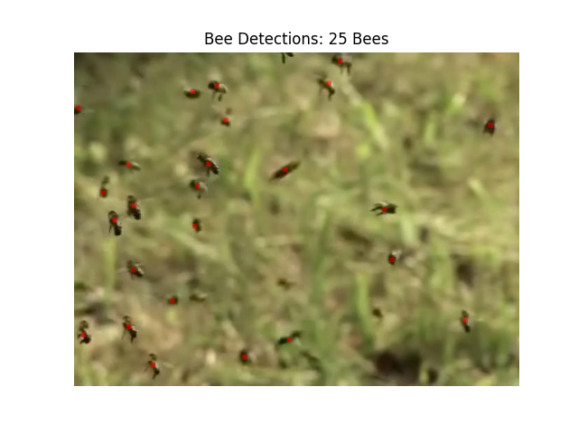

# beehive: counting bees using AI.

We want to count the number of bees flying around in order to monitor the hive. The goal of this
challenge is to automate the process of counting bees in a given image.

beehive uses a slightly modified [Centernet](https://arxiv.org/pdf/1904.07850.pdf) to achieve this.
## Solution Documentation
For methodolgy and results, check [report.md](./report.md) or [report.pdf](./report.pdf)
## Get Started

- clone project: `git clone https://github.com/aadhithya/beehive.git`

### Inference
- `bee_counter.py` is a minimal inference script that runs inference using onnxruntime.
- Insatll requirements: `pip install -r inference_requirements.txt`
- run inference: `python bee_counter.py <image-path> --show True`
- **NOTE:** The checkpoint is downloaded from github if not available locally. Check [Releases](https://github.com/aadhithya/beehive/releases/tag/weights) for checkpoints.

### Training and Development
In case you want to develop or train/evaluate/infer model you need to do the following:

### Set up using poetry
- install poetry: `pip install poetry`
- install requirements: `poetry install`

    **Note:** poetry install creates a new virtual env.
- now that the environment is created, you are ready to go.
- check installation: `python -m beehive version`

**NOTE:** using this method needs **python >= 3.9**

(or)

### Set up using pip
- install requirements: `pip install -r requirements.txt`
- install beehive in edit mode: `pip install -e .`
- check installation: `python -m beehive version`

### Download pre-trained weights
- When you inference for the first time, the corresponding model weights are automatically downloaded to the current directory from github. : When using `python -m beehive infer ...` you need to specify the `--dl` flag to enable model download.

- Models can be manually downloaded from the [Releases](https://github.com/aadhithya/beehive/releases/tag/weights).
- **Only weights for the resnet18 backbone model is available.**

### Train Model
`python -m beehive train --help`

The `splits.json` file contains the dataset splits.

### Evaluate Model
`python -m beehive eval --help`

### pytorch Inference
`python -m beehive infer path/to/image --show`

#### ONNX Export
`python -m beehive export-onnx --help`
