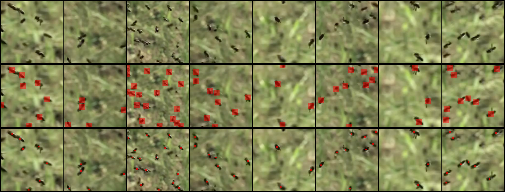
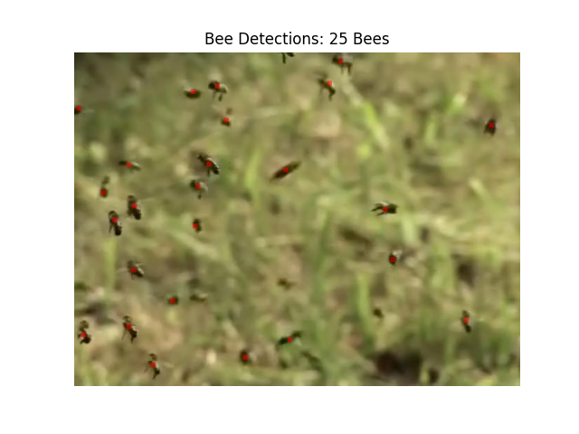

# beehive: counting bees using AI

We want to count the number of bees flying around in order to monitor the hive. You are given a sample set of images
of bees, along with ground truth labels containing dots at the centroids of each bee in the image. The goal of this
challenge is to automate the process of counting bees in a given image.

## 1. Approach
- I start by treating this as an object detection problem, where the task is to detect the centroid-keypoint of the detected obhject - in this case, bees.
- To this end, we can use a point-based object dcetection model for this task. I use the CenterNet proposed in the paper [Objects as Points](https://arxiv.org/pdf/1904.07850.pdf) by Zhou et. al. for the task.
- The CenterNet is designed to solve exactly the problem at hand - detect objects with centroid points.
- The CenterNet has a keypoint detection loss, an offset loss and a task specific loss (bounding box regression, etc.). In this implementation, I use only the keypoint detection and offset loss, as we don't care about the bounding boxes of the detection.

### 2.1. Network Architecture and Objective Functions
Here, I talk about the network archtecture and the reasons behind selecting the arch. I also discuss the objective functions and how this implementation differs from the original paper.

- For the backbone, in the interest of keepint the model small, I use the pre-trained resnet 18 model. The paper uses Hourglass and resnet architectures.

- Then we have 3 upsampling blocks with 3 conv-bn-relu layer followed by an upsampling layer. The output is at stride 4 as with the original paper. For simplicity, I use convolution layers compared to the one deformable convolution layer used in the paper.

- Then I have a KeypointHead, with 2 conv-bn-relu layers followed by a 1x1 convolution layer to output `n_classes + 2` channels, for n_classes and the x-y offsets. The paper uses separate heads for both and also have extra heads for bbox regression.

#### Objective Functions
- For the focal loss, I set `alpha = 7` and `beta = 5`.
- The focal loss is weighed at 10 compared to 1 used in the paper.
- I use L1 loss for the OffsetLoss, same as the paper.

## 2 Results
### 2.2.1 Qualitative Results
#### Valdation Set Outputs:

    **Row 1: Input Image, Row 2: Ground Truth, Row 3: Detetctions**
  

#### Test Set Visualization

    **NOTE**: Network inference was done on entire, full-res image without augmentations.

    
    
### 2.2 Quantitative Results
- Model evaluated using mAP metric. Table shows results.
- Since only centroids of the bees are known, a fixed bounding box of size 15x15 with the centroid at center was taken.

#### Table 1: mAP
| backbone | mAP50     | mAP75 | mAP   |
| -------- | --------- | ----- | ----- |
| resnet18 | 0.517     | 0.049 | 0.159 |
| resnet34 | **0.526** | 0.041 | 0.158 |

- MAE per image may give an intuition into how much the model over-predicts/under-detects bees.

#### Table 2: MAE
| backbone | MAE       |
| -------- | --------- |
| resnet18 | **0.166** |
| resnet34 | -0.583    |


## 3. Takeaways
- At first glance the model's metric may look poor compared to the original implementation, but it is to be kept in mind that the original paper benifitted from (i) supervision from box-regression head and, (ii) lots of training data.
- Since only centroids were available, this implementation only uses keypoint and offset losses.
- Furthermore, looking at qualitative results suggests that the model is indeed able to detect the bees quite well.

## 4. Training Details

### 4.1 Hyperparameters
```yml
train_steps: 3000
alpha_kp: 7
backbone: r18
beta_kp: 5
bilinear: false
head_convs: 3
lamda_kp: 10.0
lamda_offset: 1.0
lr: 0.0003
n_classes: 1
n_conv: 2
pretrained: true
upsample_channels:
  - 256
  - 128
  - 64
```
### 4.2 Augmentations to data
- For training and validation set, the following augmentations were applied:
  - Random Flip
  - Random Scale [0.6, 1.4]
  - Random Crop [256, 256]

### 4.3 Training Curves
#### Train loss

  
#### Validation loss

  
****
